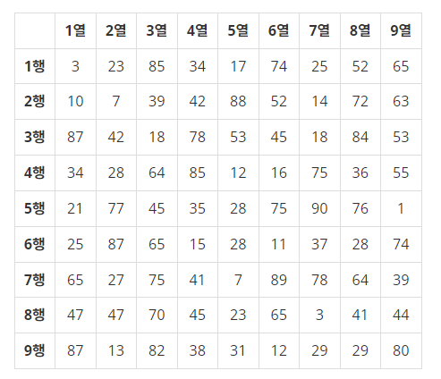

# 최댓값

[백준 > 단계별로 풀어보기 > 2차원 배열](https://www.acmicpc.net/problem/2566)

## 문제

<그림 1>과 같이 9×9 격자판에 쓰여진 81개의 자연수 또는 0이 주어질 때, 이들 중 최댓값을 찾고 그 최댓값이 몇 행 몇 열에 위치한 수인지 구하는 프로그램을 작성하시오.

예를 들어, 다음과 같이 81개의 수가 주어지면

이들 중 최댓값은 90이고, 이 값은 5행 7열에 위치한다.

## 입력

첫째 줄부터 아홉 번째 줄까지 한 줄에 아홉 개씩 수가 주어진다. 주어지는 수는 100보다 작은 자연수 또는 0이다.

## 출력

첫째 줄에 최댓값을 출력하고, 둘째 줄에 최댓값이 위치한 행 번호와 열 번호를 빈칸을 사이에 두고 차례로 출력한다. 최댓값이 두 개 이상인 경우 그 중 한 곳의 위치를 출력한다.

## 풀이

```python
max_value = column = row = 0
array = []

for i in range(9):
    a = list(map(int,input().split())) # 1차원 배열 입력받음
    array.append(a) # array배열에 입력받은 1차원배열 append
    if max_value < max(a):
        max_value = max(a) # max함수로 최대값 반환, max값을 max_value에 할당
        column = a.index(max_value)+1 # index메소드로 인덱스 반환
        row = i+1

if(max_value == 0 and row == 0 and column == 0): # 모든 속성값이 0일때 예외
    print(max_value)
    print(1,1)
else:
    print(max_value)
    print(row, column)
```
