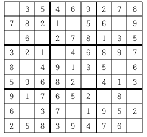
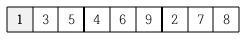
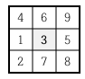
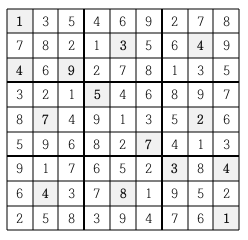

# 스도쿠

[백준 > 단계별로 풀어보기 > 백트래킹](https://www.acmicpc.net/problem/2580)

## 문제

스도쿠는 18세기 스위스 수학자가 만든 '라틴 사각형'이랑 퍼즐에서 유래한 것으로 현재 많은 인기를 누리고 있다. 이 게임은 아래 그림과 같이 가로, 세로 각각 9개씩 총 81개의 작은 칸으로 이루어진 정사각형 판 위에서 이뤄지는데, 게임 시작 전 일부 칸에는 1부터 9까지의 숫자 중 하나가 쓰여 있다.



나머지 빈 칸을 채우는 방식은 다음과 같다.

각각의 가로줄과 세로줄에는 1부터 9까지의 숫자가 한 번씩만 나타나야 한다.
굵은 선으로 구분되어 있는 3x3 정사각형 안에도 1부터 9까지의 숫자가 한 번씩만 나타나야 한다.
위의 예의 경우, 첫째 줄에는 1을 제외한 나머지 2부터 9까지의 숫자들이 이미 나타나 있으므로 첫째 줄 빈칸에는 1이 들어가야 한다.



또한 위쪽 가운데 위치한 3x3 정사각형의 경우에는 3을 제외한 나머지 숫자들이 이미 쓰여있으므로 가운데 빈 칸에는 3이 들어가야 한다.



이와 같이 빈 칸을 차례로 채워 가면 다음과 같은 최종 결과를 얻을 수 있다.



게임 시작 전 스도쿠 판에 쓰여 있는 숫자들의 정보가 주어질 때 모든 빈 칸이 채워진 최종 모습을 출력하는 프로그램을 작성하시오.

## 입력

아홉 줄에 걸쳐 한 줄에 9개씩 게임 시작 전 스도쿠판 각 줄에 쓰여 있는 숫자가 한 칸씩 띄워서 차례로 주어진다. 스도쿠 판의 빈 칸의 경우에는 0이 주어진다. 스도쿠 판을 규칙대로 채울 수 없는 경우의 입력은 주어지지 않는다.

## 풀이

```python
import sys

board = [list(map(int,sys.stdin.readline().split()))for _ in range(9)]
zero = []
num = 0
for i in range(9):
    for j in range(9):
        if board[i][j] == 0:
            zero.append([i,j])

def column(x):
    for i in range(9):
        if num == board[i][x]:
            return False
    return True

def row(y):
    for i in range(9):
        if num == board[y][i]:
            return False
    return True

def square(x, y):
    for i in range(3):
        for j in range(3):
            if num == board[y // 3 * 3 + i][x // 3 * 3 + j]:
                return False
    return True

def dfs(cnt):
    global num
    if cnt == len(zero):
        for i in range(9):
            print(*board[i])
        exit()

    for i in range(1,10):
        y = zero[cnt][0]
        x = zero[cnt][1]
        num = i
        if column(x) and row(y) and square(x,y):
            board[y][x] = i
            dfs(cnt+1)
            board[y][x] = 0

dfs(0)
```
