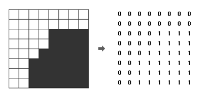

# 쿼드 트리

[백준 > 단계별로 풀어보기 > 분할 정복](https://www.acmicpc.net/problem/1992)

## 문제

흑백 영상을 압축하여 표현하는 데이터 구조로 쿼드 트리(Quad Tree)라는 방법이 있다. 흰 점을 나타내는 0과 검은 점을 나타내는 1로만 이루어진 영상(2차원 배열)에서 같은 숫자의 점들이 한 곳에 많이 몰려있으면, 쿼드 트리에서는 이를 압축하여 간단히 표현할 수 있다.

주어진 영상이 모두 0으로만 되어 있으면 압축 결과는 "0"이 되고, 모두 1로만 되어 있으면 압축 결과는 "1"이 된다. 만약 0과 1이 섞여 있으면 전체를 한 번에 나타내지를 못하고, 왼쪽 위, 오른쪽 위, 왼쪽 아래, 오른쪽 아래, 이렇게 4개의 영상으로 나누어 압축하게 되며, 이 4개의 영역을 압축한 결과를 차례대로 괄호 안에 묶어서 표현한다



위 그림에서 왼쪽의 영상은 오른쪽의 배열과 같이 숫자로 주어지며, 이 영상을 쿼드 트리 구조를 이용하여 압축하면 "(0(0011)(0(0111)01)1)"로 표현된다. N ×N 크기의 영상이 주어질 때, 이 영상을 압축한 결과를 출력하는 프로그램을 작성하시오.

## 입력

첫째 줄에는 영상의 크기를 나타내는 숫자 N 이 주어진다. N 은 언제나 2의 제곱수로 주어지며, 1 ≤ N ≤ 64의 범위를 가진다. 두 번째 줄부터는 길이 N의 문자열이 N개 들어온다. 각 문자열은 0 또는 1의 숫자로 이루어져 있으며, 영상의 각 점들을 나타낸다.

## 출력

영상을 압축한 결과를 출력한다.

## 풀이

```python
import sys

N = int(sys.stdin.readline())
video = [list(map(int,sys.stdin.readline().strip())) for _ in range(N)]

def conquer(x,y,size):
    check = video[x][y]
    for i in range(x,x+size):
        for j in range(y,y+size):
            if check != video[i][j]:
                check = -1
                break

    if check == -1:
        print("(",end="")
        conquer(x,y,size//2)
        conquer(x,y+size//2,size//2)
        conquer(x+size//2,y,size//2)
        conquer(x+size//2,y+size//2,size//2)
        print(")",end="")
    elif check == 0:
        print("0",end="")
    else:
        print("1",end="")
    return


conquer(0,0,N)
```

> conquer 재귀할 때 순서 주의!
