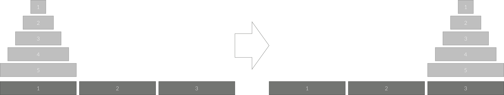

# 하노이 탑 이동 순서

[백준 > 단계별로 풀어보기 > 재귀 함수](https://www.acmicpc.net/problem/11729)

## 문제

세 개의 장대가 있고 첫 번째 장대에는 반경이 서로 다른 n개의 원판이 쌓여 있다. 각 원판은 반경이 큰 순서대로 쌓여있다. 이제 수도승들이 다음 규칙에 따라 첫 번째 장대에서 세 번째 장대로 옮기려 한다.

한 번에 한 개의 원판만을 다른 탑으로 옮길 수 있다.
쌓아 놓은 원판은 항상 위의 것이 아래의 것보다 작아야 한다.
이 작업을 수행하는데 필요한 이동 순서를 출력하는 프로그램을 작성하라. 단, 이동 횟수는 최소가 되어야 한다.

아래 그림은 원판이 5개인 경우의 예시이다.



## 입력

첫째 줄에 첫 번째 장대에 쌓인 원판의 개수 N (1 ≤ N ≤ 20)이 주어진다.

## 풀이

```python
import sys

N = int(sys.stdin.readline())

def recursion(n,start,mid,end):
  if n == 1:
    print(start,end)
    return
  recursion(n-1,start,end,mid)
  print(start,end)
  recursion(n-1,mid,start,end)
print(2 ** N - 1)
recursion(N,1,2,3)
```